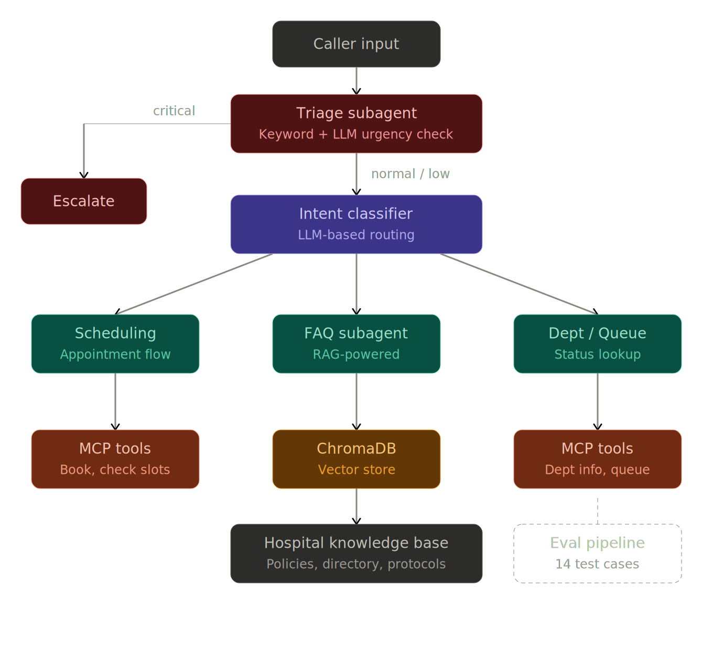

<div align="center">

# 🏥 Hospital AI Knowledge Assistant

### RAG · MCP Server · Subagents · Eval Pipeline

An end-to-end AI system that handles hospital phone calls — triaging emergencies, booking appointments, answering policy questions, and routing to human operators when needed.

Built with **Retrieval-Augmented Generation**, a **Model Context Protocol** server, **multi-subagent orchestration**, and an **automated evaluation pipeline**.

[](https://python.org)
[](https://modelcontextprotocol.io)
[](https://www.trychroma.com)
[](https://openrouter.ai)
[](LICENSE)

<br>



</div>

---

## Demo

```
Caller: I have chest pain
Triaging...
  Urgency: critical | Reasoning: Keyword match: 'chest pain'
CRITICAL — Escalating immediately

Agent: I'm transferring you to our emergency team right away.
       Please stay on the line.
--- Call transferred to human operator ---
```

```
Caller: I want to book an appointment with cardiology
Triaging...
  Urgency: normal | Reasoning: Routine non-emergency request
Classifying intent...
  Intent: APPOINTMENT
Routing to Scheduling subagent

Agent: Understood! Let's get you scheduled for Cardiology.
       Could you please confirm:
       1. Preferred date?
       2. Your full name?
```

```
Caller: What are the visiting hours?
Triaging...
  Urgency: low | Reasoning: General informational request
Classifying intent...
  Intent: POLICY_QUESTION

Agent: General visiting hours are from 10:00 AM to 8:00 PM daily.
       ICU patients may receive visitors for 15-minute intervals
       at 11:00 AM and 5:00 PM.
```

---

## Architecture

```
                        ┌──────────────────┐
                        │   Caller Input   │
                        └────────┬─────────┘
                                 │
                                 ▼
                  ┌──────────────────────────────┐
                  │      Triage Subagent          │
                  │  (keyword + LLM urgency)      │
                  └──────┬───────────┬────────────┘
                         │           │
                 critical│           │ normal/low
                         ▼           ▼
              ┌──────────────┐  ┌────────────────────┐
              │  Escalate to │  │  Intent Classifier  │
              │    Human     │  │  (LLM routing)      │
              └──────────────┘  └──┬──────┬───────┬───┘
                                   │      │       │
                    ┌──────────────┘      │       └──────────────┐
                    ▼                     ▼                      ▼
          ┌─────────────────┐  ┌──────────────────┐  ┌──────────────────┐
          │   Scheduling    │  │   FAQ Subagent   │  │  Department /    │
          │   Subagent      │  │   (RAG-powered)  │  │  Queue Lookup    │
          └────────┬────────┘  └────────┬─────────┘  └────────┬─────────┘
                   │                    │                      │
                   ▼                    ▼                      ▼
          ┌─────────────────┐  ┌──────────────────┐  ┌──────────────────┐
          │   MCP Tools     │  │  ChromaDB Vector │  │   MCP Tools      │
          │ (book, check)   │  │     Store        │  │ (dept info,      │
          └─────────────────┘  └──────────────────┘  │  queue status)   │
                                                     └──────────────────┘
```

The system follows a **triage-first** pattern — every message is assessed for urgency before any other processing. Critical emergencies (chest pain, stroke symptoms, severe bleeding) bypass all routing and escalate immediately. Non-emergency messages are classified by intent and routed to the appropriate subagent.

---

## Key Concepts Demonstrated

| Concept | Implementation | Where |
|---|---|---|
| **RAG** | Markdown → chunking → sentence-transformer embeddings → ChromaDB retrieval | `rag/` |
| **MCP Server** | Hospital tools (appointments, departments, queues, escalation) exposed via FastMCP | `mcp_server/` |
| **Subagents** | Triage, Scheduling, and FAQ agents with specialized prompts and routing logic | `agent/subagents.py` |
| **Prompt Engineering** | System prompts with safety guardrails, structured output, and medical-context rules | `agent/prompts/` |
| **Eval Pipeline** | Automated test cases with scoring for escalation accuracy, retrieval relevance, and tool selection | `evals/` |
| **Tool Use** | Agent decides when to call MCP tools vs. RAG retrieval vs. human escalation | `agent/orchestrator.py` |

---

## Project Structure

```
hospital-ai-assistant/
├── agent/
│   ├── orchestrator.py              # Main agent loop: triage → classify → route → respond
│   ├── subagents.py                 # TriageSubagent, SchedulingSubagent, FAQSubagent
│   └── prompts/
│       ├── system_prompt.py         # Orchestrator system prompt + routing classifier
│       ├── triage_prompt.py         # Medical urgency classification (JSON output)
│       └── scheduling_prompt.py     # Appointment booking flow
├── rag/
│   ├── ingest.py                    # Document → chunk → embed → store in ChromaDB
│   ├── retriever.py                 # Semantic search over hospital knowledge base
│   └── chunker.py                   # Markdown-aware text splitting with overlap
├── mcp_server/
│   ├── server.py                    # FastMCP server exposing hospital tools
│   └── hospital_tools.py           # Tool implementations (simulated hospital backend)
├── evals/
│   ├── run_evals.py                 # Eval runner with category-level reporting
│   ├── scorers.py                   # Scoring functions for each eval category
│   └── test_cases.json              # 14 test scenarios across 3 categories
├── data/
│   └── sample_docs/                 # Hospital knowledge base (Markdown)
│       ├── hospital_policies.md     # Visiting hours, insurance, medication policy
│       ├── department_directory.md  # All departments with location, phone, hours
│       └── emergency_protocols.md   # Chest pain, stroke, allergic reaction protocols
├── config/
│   └── settings.py                  # Central config (models, thresholds, RAG params)
├── .env.example                     # Environment variable template
├── .gitignore
├── requirements.txt
└── README.md
```

---

## Quick Start

### 1. Clone & Install

```bash
git clone https://github.com/AbdullahAljelamneh/hospital-ai-assistant.git
cd hospital-ai-assistant

pip install -r requirements.txt
```

### 2. Configure API Key

```bash
cp .env.example .env
# Edit .env and add your OpenRouter API key
```

Get a free API key at [openrouter.ai](https://openrouter.ai/).

### 3. Ingest the Knowledge Base

```bash
python rag/ingest.py
```

This chunks the hospital documents and embeds them into a local ChromaDB vector store.

### 4. Run the Agent

```bash
python agent/orchestrator.py
```

Type messages as if you're calling the hospital. Try:
- `"I have chest pain"` → immediate emergency escalation
- `"I want to book an appointment with cardiology"` → scheduling flow
- `"What are the visiting hours?"` → RAG-powered policy answer
- `"How long is the wait at the ER?"` → queue status via MCP tool

### 5. Run Evals

```bash
python evals/run_evals.py
```

Runs 14 automated test cases across escalation accuracy, retrieval relevance, and tool selection.

### 6. Start the MCP Server (standalone)

```bash
python mcp_server/server.py
```

Exposes hospital tools via MCP stdio transport for integration with any MCP-compatible client.

---

## Eval Pipeline

The eval system tests three critical dimensions:

**Escalation Accuracy** — Does the system correctly identify emergencies? A false negative (missing a heart attack) is catastrophic; a false positive (over-triaging a headache) is merely inefficient. The scoring reflects this asymmetry.

**Retrieval Relevance** — Does RAG pull the right documents? Scored on source match, section match, and expected content presence.

**Tool Selection** — Does the agent route to the correct MCP tool? Tested across appointment booking, queue checks, department lookups, and human transfers.

```
══════════════════════════════════════════════════════════
CATEGORY SUMMARY
══════════════════════════════════════════════════════════
Category          Avg Score  Pass Rate  Threshold   Status
──────────────────────────────────────────────────────────
escalation             0.95       83%        95%     PASS
retrieval              0.90      100%        80%     PASS
tool_selection         0.85       75%        90%     PASS
```

---

## Safety Guardrails

The system enforces non-negotiable safety rules:

- **Never diagnoses** medical conditions
- **Never recommends** specific medications or dosages
- **Never delays** emergency escalation to gather more information
- **Immediately escalates** critical keywords (chest pain, stroke, seizure, نزيف, إغماء) — both English and Arabic
- **Fails safe** — if triage JSON parsing fails, defaults to `high` urgency + human escalation
- Children under 5 and medication errors trigger automatic escalation

---

## Tech Stack

| Component | Technology |
|---|---|
| LLM | DeepSeek V3 via [OpenRouter](https://openrouter.ai) |
| Embeddings | `all-MiniLM-L6-v2` (sentence-transformers) |
| Vector Store | ChromaDB (persistent, local) |
| MCP Server | FastMCP (stdio transport) |
| Orchestration | Custom Python agent with subagent routing |
| Config | python-dotenv + centralized `settings.py` |

---

## Bilingual Support

The system handles both **English** and **Arabic** (including Jordanian dialect):

- Escalation keywords include Arabic equivalents (ألم في الصدر، نوبة قلبية، نزيف، إغماء)
- Department keywords support Arabic (طوارئ، باطنية، قلب، عظام، أطفال، أشعة، مختبر، صيدلية)
- The LLM responds in whichever language the caller uses
- Eval suite includes Arabic test cases

---

## License

MIT

---

<div align="center">
<sub>Built by <a href="https://github.com/AbdullahAljelamneh">Abdullah Aljelamneh</a> — Biomedical Engineering × AI/ML</sub>
</div>
